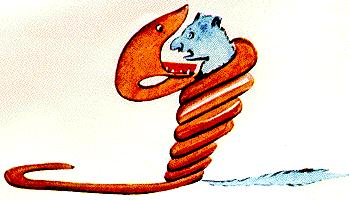
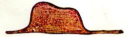

> petit: little

## DÉDICACE

_**A LÉON WERTH.**_

> a: to

Je demande pardon aux enfants d'avoir dédié ce livre à une grande personne. J'ai une excuse sérieuse: cette grande personne est le meilleur ami que j'ai au monde. J'ai une autre excuse: cette grande personne peut tout comprendre, même les livres pour enfants. J'ai une troisième excuse: cette grande personne habite la France où elle a faim et froid. Elle a bien besoin d'être consolée. Si toutes ces excuses ne suffisent pas, je veux bien dédier ce livre à l'enfant qu'a été autrefois cette grande personne. Toutes les grandes personnes ont d'abord été des enfants. (Mais peu d'entre elles s'en souviennent.) Je corrige donc ma dédicace:

> aux: to
> enfant: child
> avoir: to have
> d'avoir: having
> dédié: dedicated
> ce livre: this book
> à: to
> J'ai: I have
> sérieuse: serious
> meilleur: best
> ami: friend
> que: that
> au: in the
> monde: world
> autre: other
> peut: can
> tout: all
> comprendre: to understand
> même: even
> pour: for
> troisième: third
> habite: reside
> où: where
> elle: she
> a: is
> faim: hunger
> et: and
> froid: cold
> bien: good
> besoin: need
> d'être: to be
> consolée: consoled
> si: if
> toutes: all
> ne: not
> suffisent: are enough
> pas: not
> dédier: dedicate
> qu'a été: what was
> autrefois: once
> mais: but
> peu: little
> souviennent: remember
> corrige: correct
> donc: so
> ma: my

## PREMIER CHAPITRE

Lorsque j'avais six ans j'ai vu, une fois, une magnifique image, dans un livre sur la forêt vierge qui s'appelait "Histoires Vécues". Ça représentait un serpent boa qui avalait un fauve. Voilà la copie du dessin.

> lorsque: when
> vu: seen
> une fois: once
> magnifique: splendid
> dans: in
> sur: about
> forêt: forest
> vierge: virgin
> qui: who
> appelait: appeler --> call
> histoires: stories
> vécues: lived
> représentait: to represent
> serpent: snake
> boa: 蟒蛇
> avalait: swallow
> fauve: wild animal
> voilà: here is
> copie: copy
> du: of the
> dessin: drawing

On disait dans le livre: "Les serpents boas avalent leur proie tout entière, sans la mâcher. Ensuite ils ne peuvent plus bouger et ils dorment pendant les six mois de leur digestion".

> avalent: swallow
> leur: their
> proie: prey
> entière: whole
> mâcher: to chew
> ensuite: then
> ils: they
> peuvent: to be able to, can
> plus: more
> bouger: to move
> dorment: to sleep
> pendant: during
> mois: month
> digestion: digestion

J'ai alors beaucoup réfléchi sur les aventures de la jungle et, à mon tour, j'ai réussi, avec un crayon de couleur, à tracer mon premier dessin. Mon dessin numéro 1. Il était comme ça:

| J'ai      | I have          |
| --------- | --------------- |
| alors     | then            |
| beaucoup  | a lot           |
| réfléchi  | thought         |
| sur       | about           |
| aventures | adventures      |
| jungle    | jungle          |
| à         | in              |
| mon       | my              |
| tour      | turn            |
| réussi    | to manage to do |
| crayon    | pencil          |
| couleur   | color           |
| tracer    | trace           |
| mon       | my              |
| premier   | first           |
| numéro    | number          |
| était     | was             |
| comme     | like            |
| ça        | that            |

J'ai montré mon chef-d'oeuvre aux grandes personnes et je leur ai demandé si mon dessin leur faisait peur.

| montré        | to show     |
| ------------- | ----------- |
| chef-d'oeuvre | masterpiece |
| aux           | to          |
| si            | if          |
| faisait       | to make     |
| peur          | fear        |
| ai            | avoir       |

Elles m'ont répondu: "Pourquoi un chapeau ferait-il peur?"

| elles    | they           |
| -------- | -------------- |
| m'ont    | avoir          |
| répondu  | response       |
| pourquoi | why            |
| chapeau  | hat            |
| ferait   | faire, to make |

Mon dessin ne représentait pas un chapeau. Il représentait un serpent boa qui digérait un éléphant. J'ai alors dessiné l'intérieur du serpent boa, afin que les grandes personnes puissent comprendre. Elles ont toujours besoin d'explications. Mon dessin numéro 2 était comme ça:

| intérieur | inner       |
| --------- | ----------- |
| du        | of          |
| afin      | in order to |
| que       | that        |
| puissent  | can         |
| toujours  | always      |
| besoin    | need        |

![[0300771h-07.jpg]]

Les grandes personnes m'ont conseillé de laisser de côté les dessins de serpents boas ouverts ou fermés, et de m'intéresser plutôt à la géographie, à l'histoire, au calcul et à la grammaire. C'est ainsi que j'ai abandonné, à l'âge de six ans, une magnifique carrière de peinture. J'avais été découragé par l'insuccès de mon dessin numéro 1 et de mon dessin numéro 2. Les grandes personnes ne comprennent jamais rien toutes seules, et c'est fatigant, pour les enfants, de toujours et toujours leur donner des explications.

J'ai donc dû choisir un autre métier et j'ai appris à piloter des avions. J'ai volé un peu partout dans le monde. Et la géographie, c'est exact, m'a beaucoup servi. Je savais reconnaître, du premier coup d'oeil, la Chine de l'Arizona. C'est très utile, si l'on s'est égaré pendant la nuit.

J'ai ainsi eu, au cours de ma vie, des tas de contacts avec des tas de gens sérieux. J'ai beaucoup vécu chez les grandes personnes. Je les ai vues de très près. ça n'a pas trop amélioré mon opinion.

Quand j'en rencontrais une qui me paraissait un peu lucide, je faisais l'expérience sur elle de mon dessin numéro 1 que j'ai toujours conservé. Je voulais savoir si elle était vraiment compréhensive. Mais toujours elle me répondait: "C'est un chapeau." Alors je ne lui parlais ni de serpents boas, ni de forêts vierges, ni d'étoiles. Je me mettais à sa portée. Je lui parlais de bridge, de golf, de politique et de cravates. Et la grande personne était bien contente de connaître un homme aussi raisonnable.

| quand    | when                 |
| -------- | -------------------- |
| lucide   | lucid                |
| conservé | to keep, to preserve |
| voulais  | will                 |
| savoir   | to learn, to know    |
